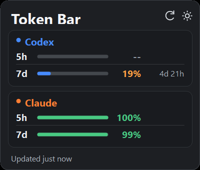

# Token Bar for Windows

Codex와 Claude Code의 남은 사용량을 Windows 시스템 트레이에서 확인하는 초경량 앱입니다.




## 특징

- 단일 실행 파일: WebView, Electron, Python, 별도 서버가 필요 없습니다.
- Codex: 로컬 세션 로그의 `rate_limits` 이벤트를 읽습니다.
- Claude: 공식 `/usage` 화면을 숨겨진 Windows 가상 터미널로 최대 15분에 한 번 확인합니다.
- Codex 로그 검색과 파싱은 백그라운드에서 수행되므로 로그가 많이 쌓여도 트레이 클릭을 막지 않습니다.
- Claude CLI는 PATH의 native 실행 파일, npm의 `.cmd`·PowerShell wrapper 및 확장자 없는 실행 shim을 지원합니다.
- 인증정보를 읽거나 저장하지 않습니다. 각 CLI에 이미 로그인되어 있어야 합니다.
- 하루에 최대 한 번 공개 GitHub Release를 확인하고 새 버전이 있으면 트레이 점과 앱 알림으로 안내합니다.
- 우측 하단 `CA` 트레이 아이콘을 누르면 시계 위에 Windows 11 스타일 패널이 열립니다.
- 패널 밖을 클릭하면 자동으로 닫히며 작업표시줄 위에 상시 오버레이하지 않습니다.
- Codex는 주간(`7d`) 잔여량을, Claude는 5시간(`5h`) 및 주간(`7d`) 잔여량을 표시합니다.

표시 값은 **남은 비율**입니다.

`C`는 Codex, `A`는 Claude입니다. 트레이 아이콘에 마우스를 올리면 요약값을, 클릭하면 전체 사용량 패널을 볼 수 있습니다.

## 설치

1. [Releases](https://github.com/tkjacob/token-bar-windows/releases/latest)에서 최신 ZIP을 내려받아 압축을 풉니다.
2. 압축을 푼 폴더에서 PowerShell을 열고 다음 명령을 실행합니다.

```powershell
powershell -ExecutionPolicy Bypass -File .\install.ps1
```

기본 설치 위치는 `%LOCALAPPDATA%\TokenBar`이며, 설치 직후 실행되고 Windows 로그인 시 자동으로 시작합니다.

삭제하려면 설치 폴더 또는 압축을 푼 폴더에서 다음 명령을 실행합니다.

```powershell
powershell -ExecutionPolicy Bypass -File .\uninstall.ps1
```

> 로컬에서 빌드한 서명되지 않은 실행 파일을 Smart App Control이 차단하는 PC에서는 설치 패키지에 포함된 PowerShell 호스트가 같은 소스를 메모리에서 실행합니다. 보안 설정을 끌 필요가 없습니다.

## 소스에서 빌드

Windows PowerShell에서:

```powershell
.\build.ps1
.\run.ps1
```

파일 탐색기에서 실행하려면 `run.cmd`를 더블클릭합니다. Windows에서 `.ps1` 파일이
메모장으로 연결되어 있어도 `run.cmd`가 PowerShell을 통해 Token Bar를 실행합니다.

기본 결과물은 `dist\TokenBar.exe` 하나입니다. Windows에 포함된 .NET Framework 컴파일러를 사용하므로 SDK 설치가 필요 없습니다.

`run.ps1`은 먼저 이 실행 파일을 시작합니다. Smart App Control이 로컬에서 빌드한 서명되지 않은 EXE를 차단하는 PC에서는, 보안 설정을 바꾸지 않고 Windows PowerShell 안에서 같은 소스를 메모리 컴파일해 자동 실행합니다.

- 일반 PC에 옮길 때: `dist\TokenBar.exe`만으로 실행 가능
- Smart App Control이 켜진 PC: 프로젝트 폴더를 유지하고 `run.cmd`를 더블클릭하거나 `run.ps1`로 실행

회귀 테스트를 실행하려면:

```powershell
.\tests\run-tests.ps1
```

테스트용 파일과 컴파일 결과는 프로젝트의 `.codex-tmp` 안에서만 생성되며 테스트 종료 시 제거됩니다.

## 사용법

- `CA` 아이콘 클릭: Token Bar 패널 열기/닫기
- `CA` 아이콘 우클릭 → **지금 새로고침**: Codex 로그와 Claude `/usage` 즉시 갱신
- `CA` 아이콘 우클릭 → **Windows 시작 시 실행**: 사용자 시작프로그램 등록/해제
- 패널 우측 상단 새로고침 버튼: 즉시 갱신
- 트레이의 업데이트 점 또는 패널의 `vX.Y.Z 업데이트` 클릭: 최신 GitHub Release 페이지 열기
- 패널 밖 클릭: 자동 닫기

Windows가 새 아이콘을 숨김 목록에 넣은 경우 작업표시줄의 숨겨진 아이콘 메뉴에서 `CA` 아이콘을 작업표시줄로 끌어오면 됩니다.

```ini
ClaudeRefreshMinutes=15
ShowCodexFiveHour=false
```

Codex의 5시간 제한이 다시 표시되어야 하는 경우 `ShowCodexFiveHour=true`로
변경하면 기존 5시간 수집·계산 코드를 그대로 사용해 행과 툴팁을 복원할 수 있습니다.

### 계정 관리

Token Bar 자체에는 "기본으로 읽어오는 계정" 같은 건 없습니다. 보이는 계정은
전부 트레이의 **계정 추가...**로 명시적으로 추가한 것만입니다 — 터미널이나 VS
Code에서 지금 어떤 Claude/Codex 계정으로 로그인돼 있는지와는 무관하게, Token
Bar가 보여주는 계정은 항상 고정돼 있습니다.

**계정 추가:** 패널 우측 상단에 항상 떠 있는 **+ 계정 추가**를 누릅니다 (트레이
우클릭 메뉴에도 같은 항목이 있습니다).

1. **이메일 주소** 입력 (예: "me@company.com") — 계정을 구분하는 키는 이
   이메일입니다. 표시용 별명이 아니라 실제로 로그인할 계정의 이메일을 적으세요.
2. **Claude 로그인 창 열기** 클릭 → 새로 뜬 창에서 평소처럼 로그인 (완료하면 창은 자동으로 닫힙니다)
3. (Codex도 쓴다면) **Codex 로그인 창 열기** 클릭 → 로그인
4. **저장** 클릭 — 재시작 없이 바로 목록에 반영됩니다

경로나 `tokenbar.ini` 문법을 직접 입력할 필요가 없습니다. 계정마다 별도의
로그인 정보 폴더가 `%LOCALAPPDATA%\TokenBar\accounts\<계정id>\`에 자동으로
생성되며, 평소 쓰는 기본 프로필(`%USERPROFILE%\.claude`, `%USERPROFILE%\.codex`)은
전혀 건드리지 않습니다.

**같은 이메일로 Claude, Codex를 따로 로그인했다면:** 나중에 "+ 계정 추가"를
다시 눌러 같은 이메일을 입력하고 나머지 한쪽만 로그인하면, 새 계정을 만들지
않고 기존 계정에 합쳐져 카드 하나에 Codex·Claude가 함께 표시됩니다. 이메일이
다르면 당연히 별도 계정으로 분리됩니다.

**연결 안 된 항목은 아예 보이지 않습니다.** Claude와 Codex 중 로그인 안 한
쪽은 카드도, 안내 문구도 뜨지 않습니다 — 로그인은 오직 "+ 계정 추가"로만
합니다. 계정이 하나도 없으면 빈 상태 메시지만 뜹니다.

**계정별 조작:** 각 계정 이름 줄 오른쪽에 **계정 삭제** 링크가 있습니다. 누르면
그 계정의 로그인 정보와 목록의 항목이 모두 삭제됩니다 — 다른 계정이나 터미널
로그인엔 영향 없고, 재시작도 필요 없이 바로 목록에서 사라집니다. 다시 쓰려면
"+ 계정 추가"로 같은 이메일을 다시 등록하면 됩니다.

계정마다 로그인 정보 폴더는 계정 id로부터 자동으로 정해집니다
(`%LOCALAPPDATA%\TokenBar\accounts\<계정id>\claude`,
`...\<계정id>\codex`) — 직접 경로를 적을 일이 없습니다. **계정 설정 파일 열기**로
여는 `tokenbar.ini`에는 이메일(라벨)만 적으면 됩니다:

```ini
Accounts=company
Account.company.Label=me@company.com
```

계정을 더 추가하려면 `Accounts=company,personal`처럼 쉼표로 나열하고
`Account.personal.Label=...`을 같은 방식으로 추가한 뒤, 위 자동 생성 경로에
`claude /login` / `codex login`으로 로그인하면 됩니다 — 다만 일반적으로는
"+ 계정 추가" 대화상자를 쓰는 편이 훨씬 간단합니다.

## 데이터의 의미와 한계

- Codex 로그는 Codex가 서버와 통신할 때 갱신됩니다. 마지막 기록의 초기화 시각이 이미 지났다면 해당 윈도우는 100% 남은 것으로 추정하고 툴팁에 `추정`으로 표시합니다.
- [Plus·Business·Pro 플랜의 Codex 5시간 제한이 일시적으로 해제된 정책](https://x.com/thsottiaux/status/2076365965915467978)에 맞춰 기본 화면에서는 Codex `5h`를 숨깁니다. 관련 bucket 파싱과 계산 코드는 향후 복원에 대비해 유지합니다.
- 여러 Codex 한도가 기록된 경우 기본 `codex` 한도를 우선합니다. 별도 모델 한도는 툴팁에 함께 표시합니다.
- Claude는 로컬에 구조화된 플랜 한도를 저장하지 않으므로 `/usage` 화면 캡처가 필요합니다. 캡처 중에도 콘솔 창은 뜨지 않습니다.
- 회사 정책이나 보안 제품이 가상 터미널 생성을 차단하면 Claude는 `--`로 표시되고 Codex만 계속 동작합니다.

## 개인정보

Token Bar가 저장·표시하는 정보는 사용률, 초기화 시각, 이벤트 시각뿐입니다. Claude `/usage` 화면 텍스트는 메모리에서 필요한 숫자만 해석한 뒤 버립니다. 프롬프트, 응답, API 키, OAuth 토큰은 수집하거나 캐시하지 않습니다.

업데이트 확인 시 하루에 최대 한 번
`api.github.com/repos/tkjacob/token-bar-windows/releases/latest`의 공개 Release
메타데이터만 인증 없이 조회합니다. Codex·Claude 사용량이나 사용자 식별정보는 전송하지
않으며, 사용자의 클릭 없이 파일을 다운로드하거나 설치하지 않습니다.

## v1.0.7

- Claude 화면이 초기 추정치를 보여준 뒤 "Scanning local sessions..."로 값을 다시
  계산해 갱신하는데, 정규식이 초기(부정확한) 값을 잡던 문제를 고쳤습니다 —
  이제 마지막(정확한) 값을 사용합니다.
- 두 화면 갱신이 겹쳐 캡처됐을 때 퍼센트와 리셋 시간이 서로 다른 갱신에서
  뒤섞여 매칭되던 문제를 고쳤습니다.
- 100%를 넘는 값처럼 불가능한 사용률이 잡히면 화면에 표시하지 않고 파싱 실패로
  처리하도록 방어 로직을 추가했습니다.

## v1.0.6

- 여러 계정이 동시에 새로고침될 때 Claude 수집이 서로 경합해서 한꺼번에 실패하던
  문제를 고쳤습니다. Claude 조회를 계정별로 순차 실행하도록 바꿨습니다.

## v1.0.5

- 계정별 마지막 사용량 값을 디스크에 저장합니다. 앱을 껐다 켜거나 일시적으로 연동이
  실패해도 마지막으로 확인된 값과 "몇 분 전" 갱신 시각이 계속 표시됩니다.
- 계정 카드에 마지막 연동 시각을 표시합니다.
- 계정 삭제 시 캐시된 값도 함께 삭제해 재추가 시 옛 값이 남지 않습니다.

## v1.0.4

- 계정을 이메일 주소로 식별하도록 바꿨습니다. 같은 이메일로 Claude·Codex를 각각 로그인하면
  자동으로 한 계정 카드에 합쳐지고, 다르면 별도 계정으로 표시됩니다.
- 계정별 로그인 정보를 완전히 분리된 폴더에 저장해 계정 간 데이터가 섞이지 않습니다.
- 계정 추가·삭제가 앱 재시작 없이 즉시 반영됩니다.
- 최신 Claude Code 버전에서 `/usage` 명령이 자동완성 타이밍 때문에 아예 실행되지 않던
  문제를 고쳤습니다.
- 주간(7d) 사용량 리셋 시간이 프로모션 배너 텍스트 때문에 파싱되지 않던 문제를 고쳤습니다.
- 연도가 없는 리셋 시각("Aug 7, 10am")이 잘못 계산되던 문제를 고쳤습니다.
- 계정 카드 사이 여백을 넓히고, 새로고침 중에는 "불러오는 중..."을 표시합니다.

## v1.0.3

- Codex 5시간 제한의 일시 해제를 반영해 기본 화면과 툴팁에서 Codex `5h`만 숨겼습니다.
- `ShowCodexFiveHour=true` 설정으로 기존 Codex 5시간 표시를 즉시 복원할 수 있습니다.
- UI를 막지 않는 공개 GitHub Release 확인과 24시간 요청 제한을 추가했습니다.
- 새 버전이 있으면 트레이 아이콘의 점, 패널 배지, 버전당 한 번의 앱 알림으로 안내합니다.
- 업데이트 배지나 알림을 클릭하면 검증된 Token Bar GitHub Release 페이지만 엽니다.

## v1.0.2

- `.ps1` 파일이 메모장으로 연결된 PC에서도 파일 탐색기에서 바로 실행할 수 있도록 `run.cmd`를 추가했습니다.
- 설치본과 배포 ZIP에 `run.cmd`가 포함됩니다.

## v1.0.1

- 대규모 Codex 세션 폴더에서도 최신 80개 후보만 유지하고 수집을 UI 스레드 밖에서 수행합니다.
- Claude 수집의 입력 대기 시간을 전체 15초 제한에 포함했습니다.
- `claude.exe`, `.com`, `.cmd`, `.bat`, `.ps1`, 확장자 없는 native shim을 PATH와 PATHEXT 기준으로 탐색합니다.
- 제거 시 설치 폴더 경계를 확인해 `TokenBarBackup` 같은 형제 폴더의 프로세스를 종료하지 않습니다.

## 참고

macOS용 [Token Ghost](https://github.com/zoeymakes/token-ghost)의 가벼운 로컬 수집 방식을 참고해 Windows용으로 새로 구현했습니다. Token Ghost는 MIT 라이선스입니다.
